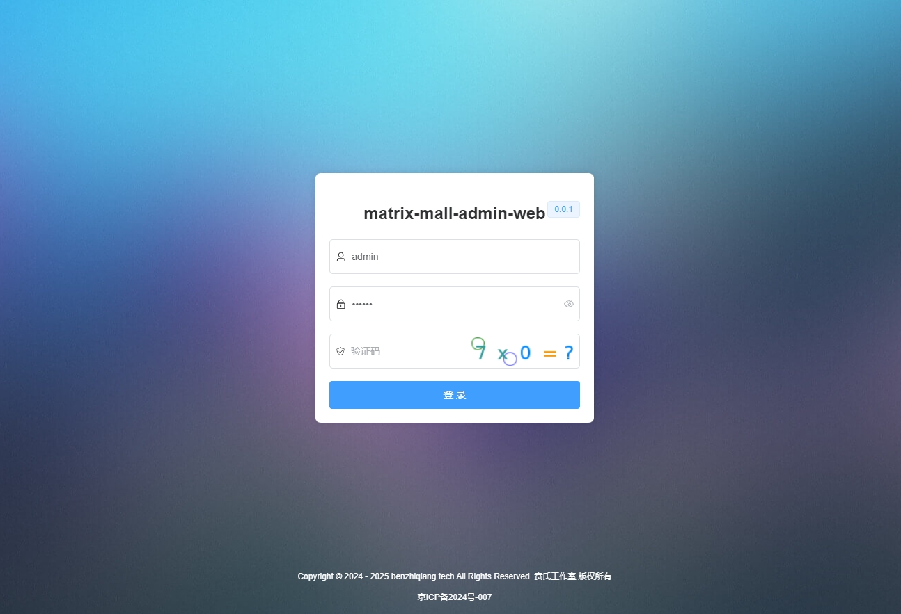
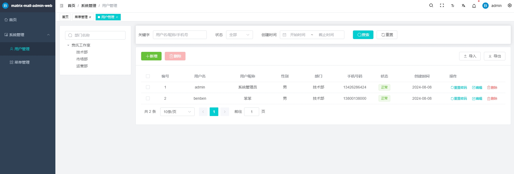
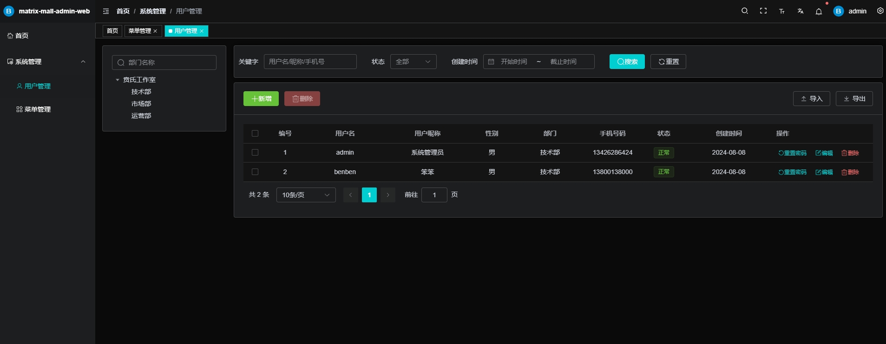

<div align="center">
  
  <h1>matrix-mall-admin-web</h1>

  
  
  
  
  <a href="https://gitee.com/benben7466" target="_blank">
      
  </a>
</div>


## 项目简介

[matrix-mall-admin-web](https://gitee.com/benben7466/matrix-mall-admin-web) 是基于 Vue3 + Vite5+ TypeScript5 + Element-Plus + Pinia 等主流技术栈构建的免费开源的中后台管理的前端模板（配套[Java 后端源码]开发中，敬请期待）

## 项目初衷

打造极简的企业级后台脚手架。


## 项目特色

- **简洁易用**：基于vue3-element-admin项目，进行相应的改良与精简，无过渡封装 ，易上手。

- **数据交互**：同时支持本地 `Mock` 和线上接口，线上接口目前处于开发中。

- **权限管理**：用户、角色、菜单等系统功能。

- **基础设施**：动态路由、按钮权限、国际化、代码规范、常用组件封装。

- **持续更新**：项目持续开源更新，实时更新工具和依赖。
- 
## 项目预览







## 项目启动

```bash
# 克隆代码
git clone https://gitee.com/benben7466/matrix-mall-admin-web.git

# 切换目录
cd matrix-mall-admin-web

# 安装依赖
yarn

# 启动运行
yarn dev --host
```
## 交流与业务洽谈🚀
>
> 作者微信：benben7466，添加时请备注您的需求与目的。
>
> 如果需要业务洽谈，请访问官网：[贲氏工作室](http://benzhiqiang.w1.luyouxia.net/)，联系电话：134-2628-6424
> 